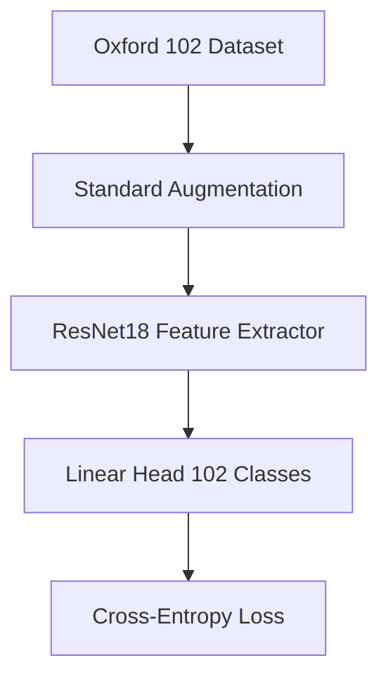

# ResNet18 Baseline Architecture & Evaluation Plan

## Objective
To fulfill the SC4001 project requirement of comparing the proposed technique (ViT with Visual Prompt Tuning, MixUp, and Triplet Loss) against an "existing method." We will implement a standard Convolutional Neural Network (CNN) fine-tuning baseline using ResNet18.

## Architecture & Setup
- **Base Model:** Pre-trained ResNet18 from `torchvision.models`.
- **Adaptation Strategy:** Standard Fine-Tuning. The pre-trained weights of the convolutional feature extractor will be loaded. The final fully connected layer (`fc`) will be replaced with a new linear layer mapping from 512 features to 102 classes (for the Oxford Flowers 102 dataset).
- **Training Paradigm:** Unlike the advanced ViT model, the baseline will be trained using standard Cross-Entropy Loss and standard data augmentation (e.g., RandomResizedCrop, RandomHorizontalFlip). MixUp and Triplet Loss will **not** be used in the baseline to clearly demonstrate the value of those additions in the main proposed method.

## Implementation Details
1. **Model File (`models/resnet_baseline.py`):** Create a class wrapper for the ResNet18 model that handles loading the pre-trained weights and replacing the classification head.
2. **Training Script (`train_baseline.py`):** Create a separate training script for the baseline model. This script will use standard Cross-Entropy Loss and train for the same number of epochs (50) as the ViT model to ensure a fair comparison. It will save its best weights to `best_resnet_baseline.pth`.
3. **Evaluation Script (`evaluation_baseline.ipynb`):** A mirrored Jupyter Notebook that loads the trained ResNet18 weights, runs inference on the `test_loader`, and generates a `classification_report.txt` and `confusion_matrix_baseline.png`.

## Success Criteria & Expected Outcomes
1. **Successful Execution:** The `train_baseline.py` script runs to completion on the remote GPU box and saves the model weights.
2. **Metric Generation:** The evaluation notebook successfully produces the classification report and confusion matrix for the ResNet18 model.
3. **Comparison:** It is highly expected that the ResNet18 baseline will achieve a lower test accuracy and show more signs of overfitting compared to the ViT-VPT model, thereby validating the proposed advanced techniques in the final university report.

## Data Flow

